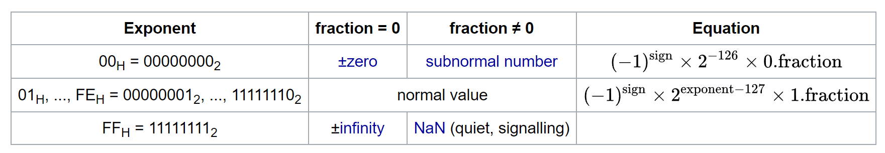
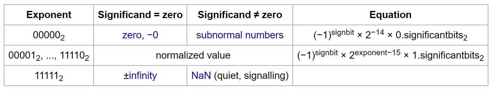

# Converting float32 to float16

This repo is personal study note on converting float32 to float16 based on article [
The many ways of converting FP32 to FP16](https://www.corsix.org/content/converting-fp32-to-fp16).
The functions from the aticle are explained in detail and stored in different files.

## IEEE 754 single-precision 32-bit binary float

The bit layout of float32 is as follows:

|s|e<sub>7</sub>|e<sub>6</sub>|e<sub>5</sub>|e<sub>4</sub>|e<sub>3</sub>|e<sub>2</sub>|e<sub>1|e<sub>0|m<sub>22|m<sub>21|m<sub>20|m<sub>19|m<sub>18|m<sub>17|m<sub>16|m<sub>15|m<sub>14|m<sub>13|m<sub>12|m<sub>11|m<sub>10|m<sub>9|m<sub>8|m<sub>7|m<sub>6|m<sub>5|m<sub>4|m<sub>3|m<sub>2</sub>|m<sub>1</sub>|m<sub>0</sub>|
|-|-|-|-|-|-|-|-|-|-|-|-|-|-|-|-|-|-|-|-|-|-|-|-|-|-|-|-|-|-|-|-|

The bits are interpreate according to following table



The value range of float32 is as follows:

|0   | subnormal  |  normal |infinity   |
|---|---|---|---|
| < 2<sup>-149</sup>  | [2<sup>-149</sup>, 2<sup>-126</sup>)  | [2<sup>-126</sup>, 2<sup>127</sup>(2 - 2<sup>-23</sup>))  | >= 2<sup>128</sup>  |

Refer to [Single-precision floating-point format](https://en.wikipedia.org/wiki/Single-precision_floating-point_format) and [Floating Point Representation](https://pages.cs.wisc.edu/~markhill/cs354/Fall2008/notes/flpt.apprec.html) for more info.

## IEEE 754 half-precision 16-bit binary float

Float16 bit layout:

|s|e<sub>4</sub>|e<sub>3</sub>|e<sub>2</sub>|e<sub>1|e<sub>0|m<sub>9|m<sub>8|m<sub>7|m<sub>6|m<sub>5|m<sub>4|m<sub>3|m<sub>2</sub>|m<sub>1</sub>|m<sub>0</sub>|
|-|-|-|-|-|-|-|-|-|-|-|-|-|-|-|-|

The bits are interpreate according to following table:



The value range of float16 is as follows:

|0   | subnormal  |  normal |infinity   |
|---|---|---|---|
| < 2<sup>-24</sup>  | [2<sup>-24</sup>, 2<sup>-14</sup>)  | [2<sup>-14</sup>, 2<sup>15</sup>(2 - 2<sup>-10</sup>))  | >= 2<sup>16</sup>  |

Refer to [Half-precision floating-point format](https://en.wikipedia.org/wiki/Half-precision_floating-point_format) for more info.

## Convert IEEE 754 float32 to IEEE 754 float16

The mapping should be:

| Float32   |      Float16      |
|----------|:-------------:|
| Infinity |  infinity |
| >= 2<sup>16</sup> |    infinity   |
| [2<sup>-14</sup>, 2<sup>15</sup>(2 - 2<sup>-10</sup>)) | normal |
| [2<sup>-24</sup>, 2<sup>-14</sup>) |    subnormal   |
| < 2<sup>-24</sup> |  0 |
| 0 |  0 |

So if the value of float32 is inifnity or 0, it is easy, just map to float16 bit values accordingly.

### Float32 normal to float16 subnormal

The normal value of float32 in range [2<sup>-24</sup>, 2<sup>-14</sup>) is mapped to subnormal value of float16.

In float32, the formular is:

2<sup>e</sup> x (2<sup>0</sup> + 2<sup>-1</sup> + 2<sup>-2</sup> ... + 2<sup>-23</sup>)

But in float16, since it is subnormal, the formular is:
2<sup>-14</sup> x (2<sup>-1</sup> + 2<sup>-2</sup> + 2<sup>-3</sup> ... + 2<sup>-10</sup>)

So in order to convert float32 to float16, if the true exponent of float32 is -15, for example, then the hidden mantissa bit (1) of float32 should be shifted to the MSB of float16 mantissa bit, namely, bit9, so it becomes 2<sup>-14</sup> x 2<sup>-1</sup> = 2<sup>-15.</sup>. Lets assume hidden bit is at position bit23, we need to shift from bit23 to bit9 (14 bits). When the true exponent of float32 is -16, then bit23 should be shifted to bit8 (15 bits), making 2<sup>-14</sup> x 2<sup>-2</sup> = 2<sup>-16.</sup>  Same logic applies to other true exponent values:

| True e in fp32  | number of bit shifted to right   |
|---|---|
|-15|14|
|-16|15|
|-17|16|
|-18|17|
|-19|18|
|-20|19|
|-21|20|
|-22|21|
|-23|22|
|-24|23|

Note that, when true exponent of float32 is -24, the hidden bit (bit23) is right shifted to bit0, the significant bits becomes 00000000000000000000001, in float16, it would be 2<sup>-14</sup> x 2<sup>-10</sup> = 2<sup>-24</sup>.

If true exponent of float32 is -25, the hidden bit is also shifted away, the signifcant bit will be all 0, thus the resultant float16 is 0.

In conclusion, the number of bits needed to be right shifted depends on the true value of exponent.

Thus, to convert float32 in this range to float16:

1. Set float16 true exponent bits to 0 (15 in biased representation)
2. Right shift the mantissa bits (including the hidden bit)

### Float32 normal to float16 normal

If float32 value is in range [2<sup>-14</sup>, 2<sup>15</sup>(2 - 2<sup>-10</sup>)), it can be mapped to float16 normal.

In float32, the formular is:

2<sup>e</sup> x (2<sup>0</sup> + 2<sup>-1</sup> + 2<sup>-2</sup> ... + 2<sup>-23</sup>)

in float16, the formular is:
2<sup>e</sup> x (2<sup>0</sup> + 2<sup>-1</sup> + 2<sup>-2</sup> ... + 2<sup>-10</sup>)

When converting from float32 to float16, we need to do:

1. Compute biased exponent for float16
2. Right shift mantissa bits 13 bits, thus dropping mantissa bits from m<sub>0</sub> to m<sub>12</sub> and round if needed.

Note that, in this case, the number of bits to be right shifted is fixed at 13 which is different in case Float32 normal to float16 subnormal.

### Optmization tricks

#### Float addition

Float addition first shift the mantissa of the smaller operan to the right in order to make its exponent equal to that of the larger operand. Thus the floating point addition circuit can be used to do the bitshift and rounding for us. [FP16](https://github.com/Maratyszcza/FP16/blob/master/include/fp16/fp16.h) makes use of this.

Refer to [Floating Point Arithmetic](https://pages.cs.wisc.edu/~markhill/cs354/Fall2008/notes/flpt.apprec.html) for more info about float addition.

Example [fp16](https://github.com/Maratyszcza/FP16/blob/master/include/fp16/fp16.h) explained in more detail:

```
/*
 * Convert a 32-bit floating-point number in IEEE single-precision format to a 16-bit floating-point number in
 * IEEE half-precision format, in bit representation.
 *
 * @note The implementation relies on IEEE-like (no assumption about rounding mode and no operations on denormals)
 * floating-point operations and bitcasts between integer and floating-point variables.
 */
static inline uint16_t fp16_ieee_from_fp32_value(float f) {
#if defined(__STDC_VERSION__) && (__STDC_VERSION__ >= 199901L) || defined(__GNUC__) && !defined(__STRICT_ANSI__)
	const float scale_to_inf = 0x1.0p+112f;
	const float scale_to_zero = 0x1.0p-110f;
#else
	const float scale_to_inf = fp32_from_bits(UINT32_C(0x77800000)); // exponent is 112
	const float scale_to_zero = fp32_from_bits(UINT32_C(0x08800000)); // exponent is -110
#endif
	// If 15 < e then inf, otherwise e += 2
	float base = (fabsf(f) * scale_to_inf) * scale_to_zero;

	const uint32_t w = fp32_to_bits(f);
	// Right shift 1, so the sign bit is dropped, only exponent and mantissa are left
	const uint32_t shl1_w = w + w;
	const uint32_t sign = w & UINT32_C(0x80000000);
	uint32_t bias = shl1_w & UINT32_C(0xFF000000); // Get the exponent bits/value of fp32
	if (bias < UINT32_C(0x71000000)) { // 113 - 127 = -14, if true e is less than -14, then it is -14
		bias = UINT32_C(0x71000000);
	}

	// bias >> 1 move exponent bits to the bit positions they are supposed to be and assume sign to be positive
	// 0x07800000 (0000 0111 1000 000 ...) --> exponent 15 = 15 << 23
	// fp32_from_bits((bias >> 1) + UINT32_C(0x07800000)) --> exponent + 15
	// base: exponent + 2
	// To make the exponent the same as bigger operand, namely, exponent + 15, the base needes to be
	// shifted right 13 bits, the result of exponent would be exponent + 15, which
	// is the biased exponent in fp16
	// If true exponent is less than -14, then bias = -14, + UINT32_C(0x07800000) --> bias is fixed
	// at 1, base exponent is exponent e + 2, if e is -15, e + 2 is -13, so need to right shifted 14
	// bits, if e is -16, 15 bits.
	base = fp32_from_bits((bias >> 1) + UINT32_C(0x07800000)) + base;
	const uint32_t bits = fp32_to_bits(base);
	// exp_bits needs to be right shifted 13 bits to shift from bit27 in fp32 to bit14 in fp16, droping 3 exponent bits away
	// If input exponent is 142 (1000 1110) (142 - 127 = 15), 142 + 15 = 1001 1101, discarding top 3 bits
	// 1 1101 --> 5 bits = 29
	// mantissa_bits takes bit10 also, which should be 1 when input exponent is 142, so 1 1101 + 1 = 1 1110 = 30
	// true exponent for 30 in fp16 is 30 - 15 = 15 which is the same as 142 in fp32
	// So droping top 3 bits is the same as substracting 128, and later adding mantissa_bits adds
	// 1 in exponent, so the whole effect of exponent + 15 - 128 + 1 = exponent - 127 + 15, which
	// is the formular to change exponent biased in fp32 to exponent biased in fp16
	const uint32_t exp_bits = (bits >> 13) & UINT32_C(0x00007C00);// Get the 5-bit exponents 0111 1100
	const uint32_t mantissa_bits = bits & UINT32_C(0x00000FFF);
	const uint32_t nonsign = exp_bits + mantissa_bits;
	return (sign >> 16) | (shl1_w > UINT32_C(0xFF000000) ? UINT16_C(0x7E00) : nonsign);
}
```
